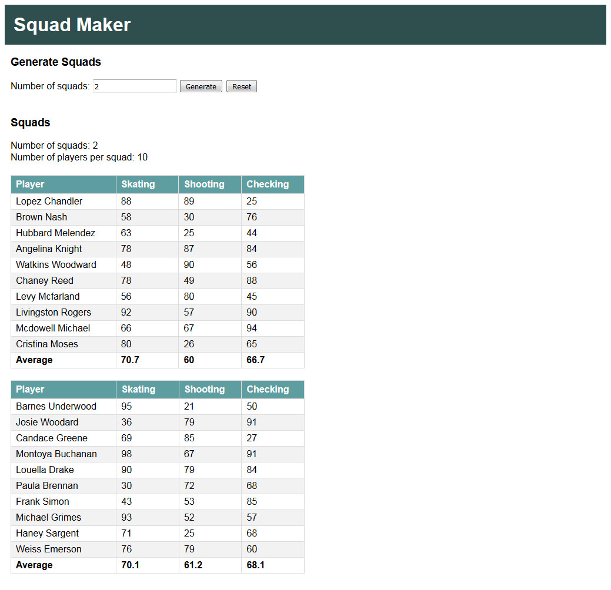
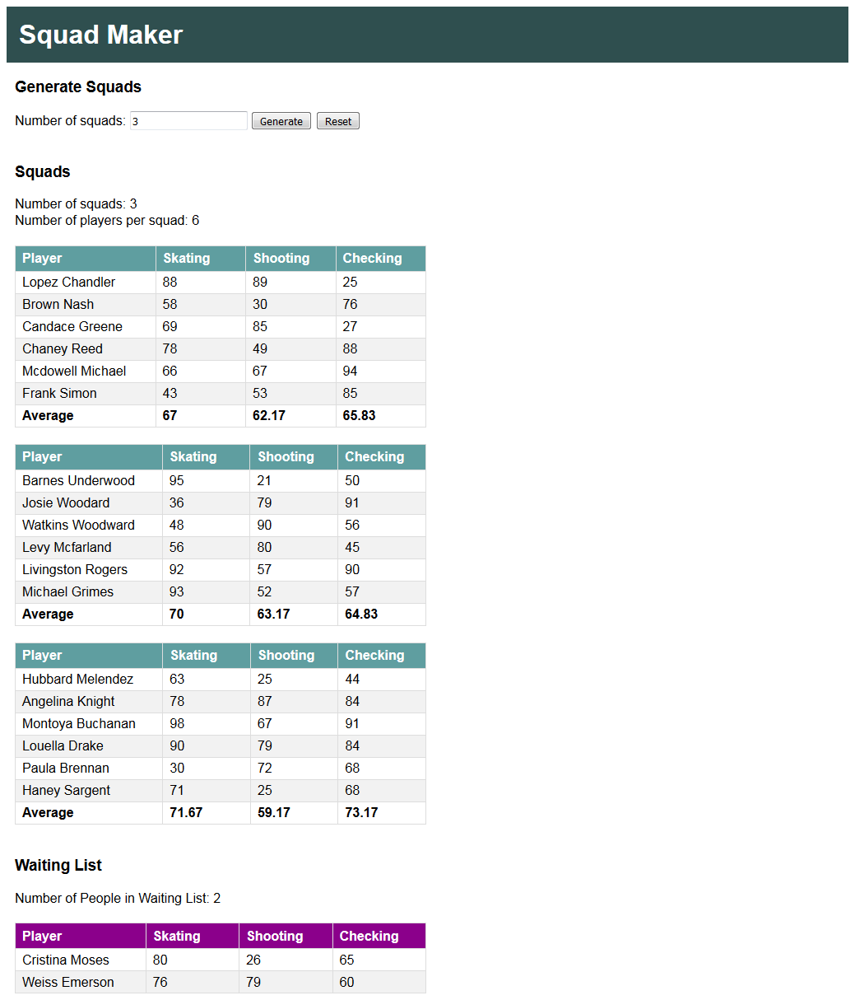

# SquadMaker
Application for the Squad Maker challenge (https://github.com/darryl-mccool/squad-maker) that creates equally matched hockey squads from a collection of players.

## Getting Started
To run Squad Maker locally, you need:
* to have Git installed on your computer
* any version of Visual Studio 2017 (A free version of Visual Studio Community can be found here: https://www.visualstudio.com/downloads/)

Once you have downloaded the project from git, open the application code in the IDE by double clicking on the **SquadMaker.sln** file in the **SquadMaker** folder.

To run the program locally using the IDE, in the menu bar choose **Debug**, **Start Debugging** (or hit the **F5** key)

To run the program with different sample data, update the **testjson.txt** file in the **SquadMaker** folder with your new JSON.

## Assumptions Made
* That the player data available from the API matches the sample format and will be complete (ie. each player will always have Skating/Shooting/Checking skills)
* That the player data will change often enough that it is more useful to always get data from the API instead of saving the players to a DB
* That there is no need to store the squads created
* That no authentication for the page is required (anyone can access and view the page)
* That as a small personal project, there was no need for a development branch, so all commits were made to master

## Usage
The home page contains a **Generate Squads** control that allows a user to enter their desired number of squads, and shows a waiting list of all players to be put into squads.

When the user clicks on the **Generate** button, each generated squad will be displayed in a table that shows the player name, skating rating, shooting rating, and checking rating. At the bottom of each squad table, the user can see the average skating, shooting, and checking rating for the squad. Each squad will have the same number of players.

If there are players left over that cannot be assigned to a squad, they will be displayed below the list of squads in a Waiting List table.

Clicking on the **Reset** button will clear out any created squads and put all the players back into the Waiting List table.

## Running the Tests
Unit tests can be found in the **SquadMakerTests** folder.

First, make sure all required packages to run the tests are installed by right clicking on the **Solution** and selecting **Restore NuGet Packages**. After this has run, a **packages** folder will have been created and added into the **SquadMaker** folder.

To run all the tests in the solution, in the menu bar, choose **Test**, **Run**, **All Tests** (or hit **Ctrl+R,A** key)

The tests will be run in the **Test Explorer** window. Once the tests have been run, **Test Explorer**  will display the results of the tests and indicate if they passed or failed.

