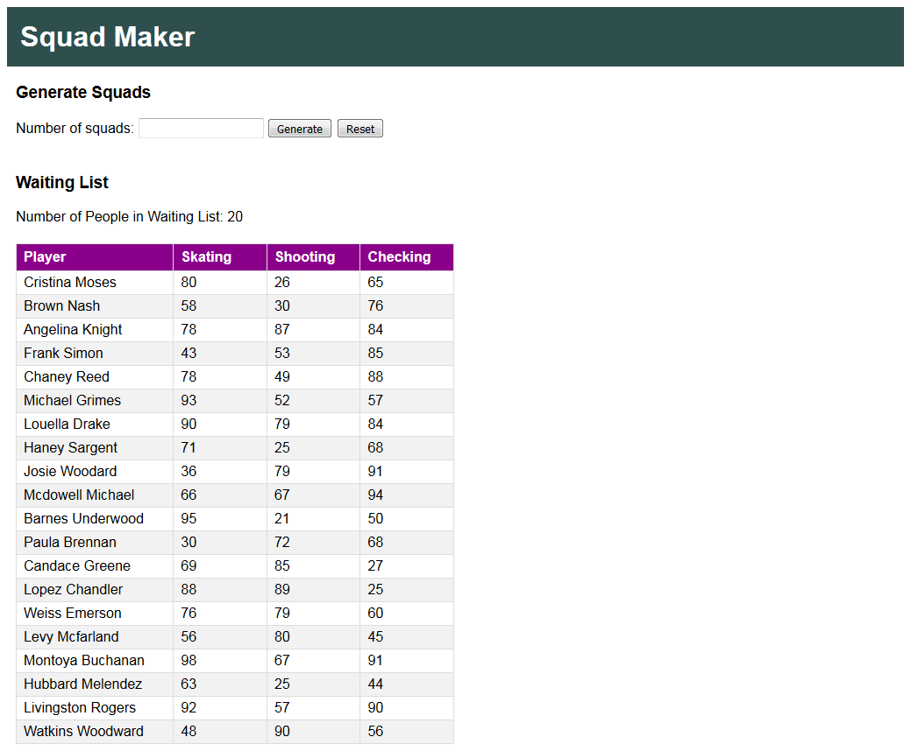

<h1>Squad Maker</h1>

Application for the Squad Maker challenge (https://github.com/darryl-mccool/squad-maker) that creates equally matched hockey squads from a collection of players.

<h2>Getting Started</h2>

To run Squad Maker locally, you need:

<ul>
  <li>to be running Windows</li>
  <li>any version of Visual Studio 2017 (A free version of Visual Studio Community can be found here: https://www.visualstudio.com/downloads/)</li>
</ul>

Once you have downloaded the project from git, view the application code by double clicking on the <b>SquadMaker.sln</b> file

One the project is open, make sure all required packages are installed by right clicking on the Solution and selecting <b>Restore NuGet Packages</b>

To run the program in the IDE, in the menu bar, choose <b>Debug</b>, <b>Start Debugging</b> (or hit the <b>F5</b> key)

<h2>Running the Tests</h2>

In the menu bar, choose <b>Test</b>, <b>Run</b>, <b>All Tests</b> (or hit <b>Ctrl+R,A</b> key)

The tests will run in the Test Explorer and indicate if they passed or failed

<h2>Assumptions Made</h2>
<ul>
  <li>That the player data available from the API matches the sample format and will be complete (ie. each player will always have Skating/Shooting/Checking skills)</li>
  <li>That the player data will change often enough that it is more useful to always get data from the API instead of saving the players to a DB</li>
  <li>That there is no need to store the squads created</li>
  <li>No authentication for the page is required (anyone can access and view the page)</li>
</ul>
<h2>Usage</h2>

The home page contains a control that allows a user to enter their desired number of squads, and shows a waiting list of all players.

When the user clicks on the Generate button, the generated squads will be displayed in tables that show the player names, skating rating, shooting rating, and checking rating. At the bottom of each squad table, the user can see the average skating, shooting, and checking rating for the squad. Each squad will have the same number of players.

[!ScreenShot](SquadMaker_SquadsNoWaitlist.png)

If there are players left over that cannot be assigned to a squad, they will be displayed below the squad lists in a Waiting List table.

Clicking on the reset button will clear out any created squads and put all the players back into the Waiting List table.

